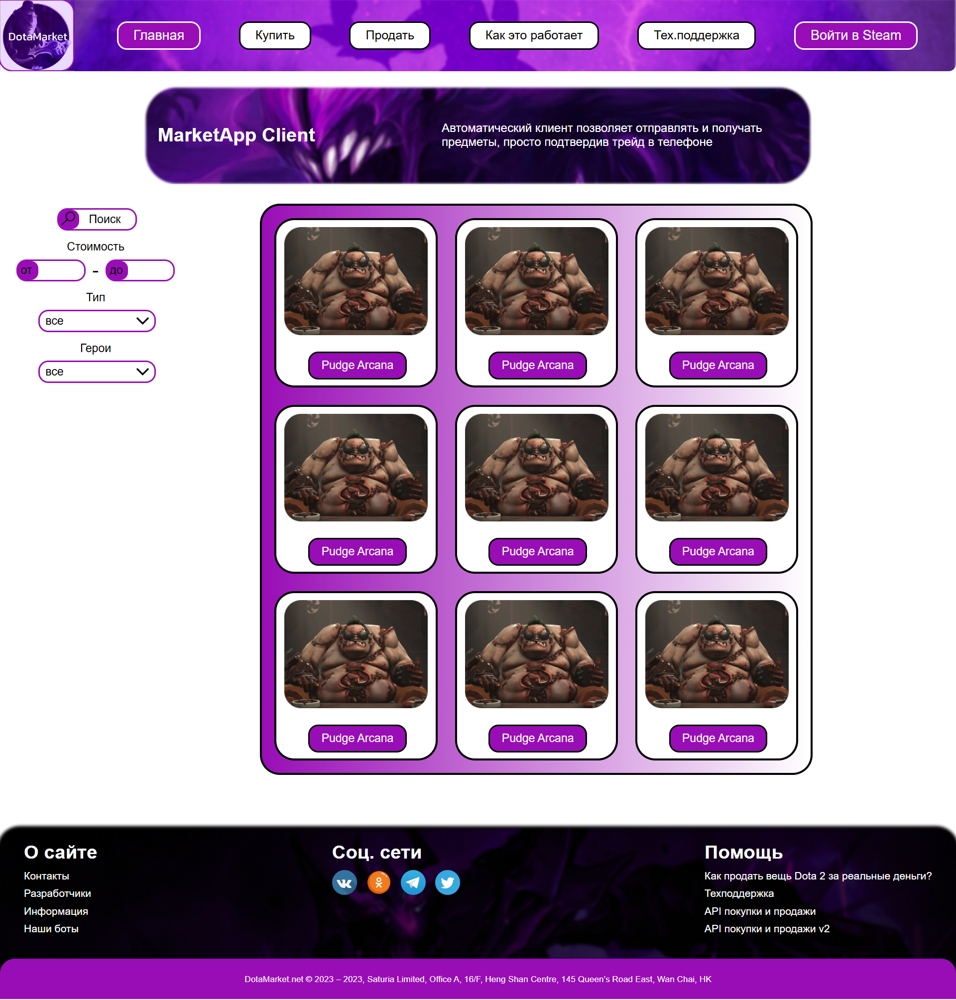

# 🎮 DotaMarket — Торговая площадка Dota 2



## 🚀 Особенности

### 🌐 Основные технологии

- Чистый HTML5 (семантическая верстка)
- CSS3 (Flexbox/Grid + анимации)
- Ванильный JavaScript (без фреймворков)


### 🛠️ Функционал

- 📱 Адаптивный интерфейс (от 320px до 4K)
- 🖼️ Слайдер популярных товаров (карусель)
- 💳 Модальное окно оплаты (кастомная реализация)
- 🔄 Живая лента последних сделок (анимированная)


## 💻 Код реализации

### Слайдер товаров
```javascript
class ItemSlider {
  constructor() {
    this.currentIndex = 0;
    this.items = document.querySelectorAll('.slider-item');
  }
  
  next() {
    this.items[this.currentIndex].classList.remove('active');
    this.currentIndex = (this.currentIndex + 1) % this.items.length;
    this.items[this.currentIndex].classList.add('active');
  }
}
```

### Модальное окно оплаты
```javascript
function showPaymentModal(item) {
  const modal = document.getElementById('payment-modal');
  modal.querySelector('.item-name').textContent = item.name;
  modal.style.display = 'block';
  document.body.style.overflow = 'hidden';
}
```

### Живая лента продаж
```javascript
function updateLiveFeed(sale) {
  const feed = document.getElementById('live-feed');
  const newItem = document.createElement('div');
  newItem.innerHTML = `
    <span class="item">${sale.item}</span>
    <span class="price">$${sale.price}</span>
  `;
  feed.insertBefore(newItem, feed.firstChild);
  if(feed.children.length > 10) {
    feed.removeChild(feed.lastChild);
  }
}
```

## 🛠 Установка
1. Клонировать репозиторий
2. Открыть `index.html` в браузере

## 📈 Планы развития

- [ ] Интеграция с Steam API
- [ ] Система рейтингов продавцов
- [ ] Фильтрация по параметрам предметов

---

<div align="center">
  <sub>Создано для сообщества Dota 2 | 2023</sub>
</div>
